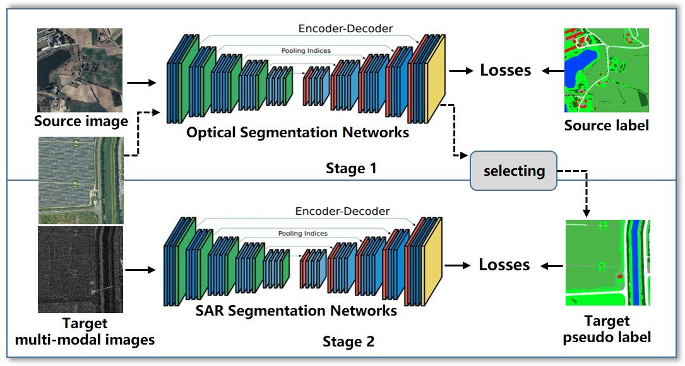

# Code for GRSS DFC 2025 track1.

***
## 1.Conda env
Cuda version is 11.8.
```commandline
conda create -n mmseg_dfc python=3.10
source activate mmseg_dfc
pip install torch==2.1.2 torchvision==0.16.2 torchaudio==2.1.2 --index-url https://download.pytorch.org/whl/cu118
pip install mmcv=2.1.0 -f https://download.openmmlab.com/mmcv/dist/cu118/torch2.1/index.html
pip install mmengine==0.10.2
cd src/causal-conv1d-1.0.2
pip install -e .
cd ../mamba-1.0.1
pip install -e .
cd ../..
pip install -e .
pip install ttach
pip install kornia
pip install ftfy
pip install scikit-image
pip install timm
```

## 2.Data prepare
Please see in file 'data/DFC2025Track1/copy_dataset_here'.

- If testing only, please copy the OEM-SAR test images to 'data/DFC2025Track1/test/sar_images'.
- If training, the open-earth-map (OEM) and open-erath-map-SAR (OEM-SAR) are utilized to train our method. \
Please reorganize the dir tree as shown in 'data/copy_dataset_here'.

## 3.Test
Reproduce similarity results:
```commandline
bash run_report.sh
```
Note that the final results is slightly lower than the score in leaderboard,
because our newest model-checkpoints are deleted along with the docker in 'www.autodl.com'.
We don't know we have the chance to submit our code and weights.

## 4.Train
You can also find the training pipline for a single model in 'run_pipline.sh':`

```commandline
bash run_report.sh
```
